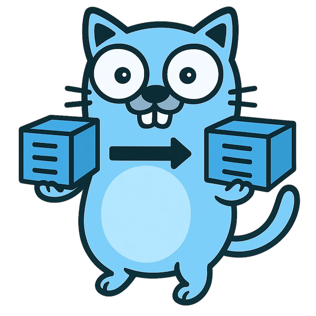

# ⚠️ Disclaimer

This is an **absolutely experimental WIP project**.
Do **not** use it in production environments.

# k8s-copycat for Container Images



k8s-copycat monitors your cluster’s **Deployments**, **StatefulSets**, **DaemonSets**, **Jobs**, **CronJobs**, and **Pods** to mirror their container images into **AWS ECR** or any other Docker-compatible registry. Tune the behavior with namespace allow/deny lists, workload skip lists, repo prefix templating, and more so the sync fits your environment.

## Why Does This Project Exist?

In recent times, we have repeatedly run into situations where official registries:

- Serve different image versions
- Become overloaded
- Enforce strict pull limits
- Are taken down completely
- Have images deleted without notice

To ensure we always have a reliable backup of the
images running in our cluster—**without swapping them out**—this project was born.

Yes, there are pull-through proxies like Harbor or other caching options.
But the goal here is different: to maintain a **dedicated registry** that holds all the critical images we need, so we can access them instantly when it really matters.

Additionally, we explicitly want a solution **not using admission webhooks**. In our case, we always have to work with proxies through EKS/Cilium nodeport availability. See [cilium/cilium#21959](https://github.com/cilium/cilium/issues/21959) for more context.

**Inspired by:**
[estahn/k8s-image-swapper](https://github.com/estahn/k8s-image-swapper)

## Environment Variables

- `TARGET_KIND`: `ecr` (default) or `docker`
- `AWS_REGION`, `ECR_ACCOUNT_ID`, `ECR_REPO_PREFIX`, `ECR_CREATE_REPO` (for ECR)
- `TARGET_REGISTRY`, `TARGET_REPO_PREFIX`, `TARGET_USERNAME`, `TARGET_PASSWORD`, `TARGET_INSECURE` (for Docker)
- `INCLUDE_NAMESPACES`: `*` or comma-separated list (e.g., `default,prod`)
- `SKIP_NAMESPACES`: comma-separated namespaces that should be ignored entirely
- `SKIP_DEPLOYMENTS`, `SKIP_STATEFULSETS`, `SKIP_DAEMONSETS`, `SKIP_JOBS`, `SKIP_CRONJOBS`, `SKIP_PODS`: comma-separated workload names to ignore
- `WATCH_RESOURCES`: comma-separated list of resource types to watch (default `deployments,statefulsets,daemonsets,jobs,cronjobs,pods`)
- `REGISTRY_REQUEST_TIMEOUT`: override the timeout (in seconds) for individual pull/push operations (default `120`)
- `FAILURE_COOLDOWN_MINUTES`: minutes to wait before retrying a failed mirror operation (default `1440`, set to `0` to disable)
- `DIGEST_PULL`: when `true`, resolve tag references to their digest before pulling (default `false`)
- `ALLOW_DIFFERENT_DIGEST_REPUSH`: when `true`, allow overwriting an existing tag that already exists with a different digest (default `true`, always ignored for the `latest` tag)
- `DRY_RUN`: when `true`, mirror images without pushing them to the target registry (default `false`)
- `DRY_PULL`: when `true`, log which images would be fetched from the source registry without contacting it (default `false`)
- `METRICS_ADDR`: bind address for the Prometheus metrics endpoint (default `:8080`)
- Optional `pathMap` in the config file rewrites repository paths before pushing

### Selecting watched workloads

By default, k8s-copycat watches Deployments, StatefulSets, DaemonSets, Jobs,
CronJobs, and stand-alone Pods. You can narrow the scope by providing
`WATCH_RESOURCES` (environment variable) or `watchResources` in the config
file. Supported values are `deployments`, `statefulsets`, `daemonsets`, `jobs`,
`cronjobs`, and `pods` (case-insensitive). Any unsupported entries are rejected
at startup so you can fix typos before the controller begins to run.

### Repository prefix templating

When a `repoPrefix` is configured (via config file or the corresponding
environment variables), the value can include placeholders that are replaced at
runtime. The following tokens are supported:

- `$namespace` — Namespace of the workload or pod referencing the image
- `$podname` — Name of the owning resource (or pod when available)
- `$container_name` — Name of the container that uses the image

For example, setting `repoPrefix: "$namespace/$podname"` ensures that the
resulting target repositories are unique across namespaces, even when multiple
workloads reference the same source image.

### Applying an ECR lifecycle policy

You can provide an [ECR lifecycle policy](https://docs.aws.amazon.com/AmazonECR/latest/userguide/lifecycle_policy_examples.html)
in the config file. When a repository is created by k8s-copycat, the policy is applied automatically.

```yaml
ecr:
  lifecyclePolicy: |
    {
      "rules": [
        {
          "rulePriority": 1,
          "description": "Retain only the five most recent images",
          "selection": {
            "tagStatus": "any",
            "countType": "imageCountMoreThan",
            "countNumber": 5
          },
          "action": { "type": "expire" }
        }
      ]
    }
```

### Example `config.yaml` Snippet

```yaml
digestPull: true                  # resolve source tags to their immutable digest before pulling
allowDifferentDigestRepush: false # optional: fail when the target tag already exists with a different digest (except for "latest")
watchResources:
  - deployments                # default: listen to all supported resource types
  - statefulsets
  - daemonsets
  - jobs
  - cronjobs
  - pods
skipNamespaces: []               # default: allow all namespaces
skipNames:
  deployments: []               # default: watch every Deployment
  statefulSets: []              # default: watch every StatefulSet
  daemonSets: []                # default: watch every DaemonSet
  jobs: []                      # default: watch every Job
  cronJobs: []                  # default: watch every CronJob
  pods: []                      # default: watch every stand-alone Pod
maxConcurrentReconciles: 2       # default: two workers per controller
pathMap:
  - from: "group/project"
    to: "prod/project"
  - from: "^legacy/(.*)"
    to: "modern/$1"
    regex: true
```

Rules are evaluated in order, with the first matching entry applied. Leaving
`pathMap` empty keeps repository paths unchanged.

When `maxConcurrentReconciles` is omitted, copycat defaults to two workers per controller. You can also override the value at
runtime via the `MAX_CONCURRENT_RECONCILES` environment variable.

### Configuring registry credentials

You can provide additional credentials used when pulling source images. This is
useful for authenticating against Docker Hub or other registries even when
mirroring into a different target such as ECR.

```yaml
requestTimeout: 120          # seconds; set to 0 to disable per-request deadlines
failureCooldownMinutes: 60   # retry failed pushes after one hour; set to 0 to disable the cooldown
forceReconcileMinutes: 30    # rescan all watched resources every 30 minutes; set to 0 to disable the periodic resync
registryCredentials:
  - registry: registry-1.docker.io
    usernameEnv: DOCKERHUB_USERNAME
    passwordEnv: DOCKERHUB_PASSWORD
  - registry: ghcr.io
    tokenEnv: GHCR_TOKEN
```

`requestTimeout` limits how long copycat waits for each registry pull and push. When the timeout elapses, the current operation is aborted so the controller can retry later. Setting the value to `0` (or omitting it) disables the per-request deadline and lets copycat rely on the underlying client timeouts.

When `failureCooldownMinutes` is set to `0`, copycat retries failed pushes immediately without recording cooldown state. Omit the field to use the default of 24 hours.

`forceReconcileMinutes` triggers a periodic full resync for all watched resources, mirroring the behavior seen immediately after startup. This ensures every workload is re-evaluated on a fixed cadence so images are repushed even without new Kubernetes events.

### Operational HTTP endpoints

Copycat exposes a pair of helper endpoints on the metrics listener (default `:8080`) to trigger common maintenance actions on demand:

- `POST /reset-cooldown` clears the failure cooldown state so failed mirrors are eligible for immediate retry.
- `POST /force-reconcile` performs a one-off full reconciliation across all watched workloads, mirroring their images using the same rules as the controllers.

Both endpoints return JSON responses describing the action that was taken. Requests can also be issued with `GET` for compatibility with simple tooling.

### Guaranteeing digest consistency

Set `digestPull: true` (or the `DIGEST_PULL` environment variable) to pin mirrored images to the digest that was active when the controller observed the workload. Copycat resolves the tag to its digest first and then pulls using that immutable reference, reducing the risk of race conditions when upstream registries re-tag images.

By default, copycat overwrites existing image tags at the target registry even when the digest differs from the source so the mirrored repository always matches what is currently running. Enable the safeguard by setting `allowDifferentDigestRepush: false` (or `ALLOW_DIFFERENT_DIGEST_REPUSH=false`) when you want copycat to refuse replacing tags that already exist with a different digest. The protection is always skipped for the conventional `latest` tag to maintain the previous behavior for mutable tags.

Credentials can be supplied directly in the configuration file via `username`,
`password`, or `token`, but using environment variables (referenced through
`*Env` fields) is recommended for secrets. When a token is provided it is sent as
an authentication bearer token; otherwise basic authentication is used.

## Build Container

```bash
docker build -t ghcr.io/matzegebbe/k8s-copycat:main .
```

## How It Works

- Manager (controller-runtime) runs controllers for Deployments, StatefulSets, Jobs, CronJobs, and Pods
- On events, we collect images from the PodSpec and push them to the target registry

## Dry Run Modes

k8s-copycat provides two complementary dry-run toggles that help validate configuration without mutating registries.

- **Push dry-run** skips writing images to the target registry after they have been mirrored locally. Enable it with the `--dry-run` flag, by setting `dryRun: true` in your configuration file, or through the `DRY_RUN` environment variable.
- **Pull dry-run** logs which images would be retrieved from the source registry without contacting it. Enable it with the `--dry-pull` flag, by setting `dryPull: true` in your configuration file, or via the `DRY_PULL` environment variable.

Both flags can be used together or independently depending on how much of the mirroring workflow you want to exercise.

## Testing with Kind

You can validate a copycat deployment locally by creating a [kind](https://kind.sigs.k8s.io/) cluster and applying the provided manifest. The default configuration in `manifests/k8s.yaml` enables dry-run mode so no registry pushes are attempted during the smoke test.

1. Create a fresh kind cluster:

   ```bash
   kind create cluster --name copycat
   ```

2. Apply the manifest from this repository:

   ```bash
   kubectl apply -f manifests/k8s.yaml
   ```

3. Wait for the controller to become ready:

   ```bash
   kubectl wait --for=condition=available deployment/k8s-copycat -n k8s-copycat --timeout=120s
   ```

4. Inspect the logs to confirm the manager starts successfully and begins watching workloads:

   ```bash
   kubectl logs deployment/k8s-copycat -n k8s-copycat
   ```

5. When you are done testing, delete the cluster:

   ```bash
   kind delete cluster --name copycat
   ```

Switch off dry-run mode and update the configuration (for example, uncomment the Docker registry settings in the ConfigMap) before deploying to a shared "General" cluster so that images are mirrored into your real registry.

## Metrics

k8s-copycat exposes Prometheus metrics on `/metrics`. The listener binds to the
address configured via `METRICS_ADDR` (default `:8080`).

### Scraping with Prometheus

Add a scrape job to your Prometheus configuration:

```yaml
scrape_configs:
  - job_name: "k8s-copycat"
    static_configs:
      - targets: ["k8s-copycat.default.svc:8080"]
```

The service publishes the following counters labelled by the image name:

- `k8s_copycat_registry_pull_success_total{image="<name>"}`
- `k8s_copycat_registry_pull_error_total{image="<name>"}`
- `k8s_copycat_registry_push_success_total{image="<name>"}`
- `k8s_copycat_registry_push_error_total{image="<name>"}`

### Example Queries

```promql
sum by (image) (rate(k8s_copycat_registry_pull_success_total[5m]))
```

```promql
sum(rate(k8s_copycat_registry_push_success_total[5m]))
```

```promql
sum(rate(k8s_copycat_registry_push_error_total[5m]))
```

These queries reveal the busiest images, overall push throughput, and any spikes in failed pushes.

## Contributing

See [docs/CONTRIBUTING.md](docs/CONTRIBUTING.md) for the coding standards,
linters, and Conventional Commits policy.
