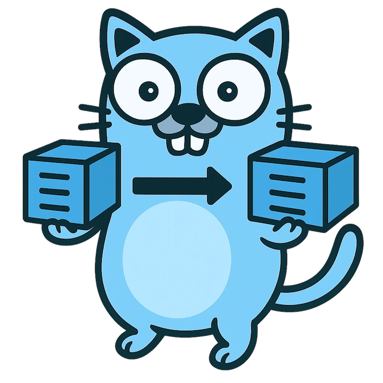
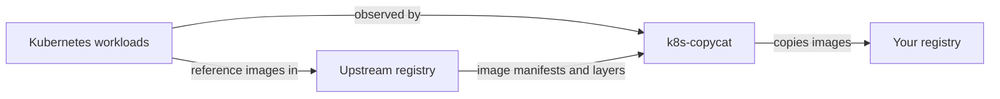
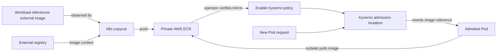

# k8s-copycat



k8s-copycat watches the container images referenced by Kubernetes workloads and copies them into a registry you control. It keeps a mirror of your runtime dependencies in AWS ECR or another Docker-compatible registry, without changing your workloads.

[Quick start](#quick-start) · [Configuration](#configuration-reference) · [Example configuration](#example-configuration) · [Troubleshooting](#observability-and-troubleshooting) · [Optional Kyverno use case](#use-case-copycat--kyverno-image-replacement)

## What does it do?

An upstream image can disappear, a tag can be deleted or changed, and a public registry can become unavailable, overloaded, or rate-limited. k8s-copycat provides an insurance policy: preserve the images your cluster uses while they are still available, so you have your own copy when you need it.


```mermaid
flowchart LR
    W[Kubernetes workloads] -->|reference images in| U[Upstream registry]
    W -->|observed by| C[k8s-copycat]
    U -->|image manifests and layers| C
    C -->|copies images| R[Your registry]
```

The controller watches **Deployments, StatefulSets, DaemonSets, Jobs, CronJobs, and Pods**, including regular, init, and ephemeral container images. It discovers existing workloads and reacts to changes through the Kubernetes API, then mirrors their referenced images asynchronously.

k8s-copycat does not modify workloads, require restarts, or sit in the image pull path. It is not a pull-through proxy. You can leave it running to keep your mirror populated with the images your clusters use.

**A mirror only helps runtime availability once workloads can pull from it.** Configure image replacement or a recovery procedure separately. Mirroring must happen before the source disappears; k8s-copycat fetches images from registries, not from node-local caches. To preserve content when tags change, see [digest and tag behavior](#digest-and-tag-behavior).

### How it compares

| Approach | How it works |
| --- | --- |
| **k8s-copycat** | Observes Kubernetes workloads and asynchronously mirrors referenced images. |
| Pull-through cache | Sits in the image retrieval path and fetches upstream images when requested. |
| Admission webhook / Kyverno | Changes or validates resource definitions during admission. |
| CI-based mirroring | Copies known images during the build or deployment process. |

## Common use cases

- **Registry outage protection:** keep copies of images used in the cluster so you can switch to them during an upstream outage.
- **Public registry rate limits:** populate your own registry, then direct runtime pulls there to reduce dependence on Docker Hub, GHCR, or Quay.
- **Private ECR as the runtime source:** combine mirroring with an admission mechanism; see the optional [Kyverno use case](#use-case-copycat--kyverno-image-replacement).
- **Disaster recovery:** retain runtime dependencies independently of their original registry, with retention policies suited to your recovery window.
- **Multi-architecture clusters:** copy full manifest lists by default, or select platforms with digest mirroring. See [multi-architecture images](#multi-architecture-images) for the tradeoffs.

## Quick start

### Try observation without pushing images

You need `kubectl` access to a cluster and permission to create the bundled RBAC resources. For a disposable local cluster, first run `kind create cluster --name copycat`.

Download a tagged manifest and pin its controller image to the same release. The [latest release checked for this README is v0.37.0](https://github.com/matzegebbe/k8s-copycat/releases/tag/v0.37.0). **The manifest at that tag still specifies image v0.6.3**, so the local image update below is necessary.

```bash
VERSION=v0.37.0
curl -fsSL "https://raw.githubusercontent.com/matzegebbe/k8s-copycat/${VERSION}/manifests/k8s.yaml" -o copycat-release.yaml
sed "s|image: ghcr.io/matzegebbe/k8s-copycat:.*|image: ghcr.io/matzegebbe/k8s-copycat:${VERSION}|" \
  copycat-release.yaml > copycat.yaml
kubectl apply -f copycat.yaml
kubectl wait --for=condition=available deployment/k8s-copycat \
  -n k8s-copycat --timeout=180s
kubectl create deployment copycat-demo -n test --image=nginx:stable
kubectl logs -n k8s-copycat deployment/k8s-copycat --follow
```

The manifest creates `k8s-copycat` and `test` namespaces, watches only `test`, and enables debug logging, `dryRun`, and `dryPull`. Expect source and target references followed by `dry pull: skipping source registry fetch`; no images are pushed. **Dry-pull still fetches source descriptors and may perform authentication or digest checks**, so registry connectivity is required. The configured demo destination need not exist for this tag-based smoke test.

Remove the demo with `kubectl delete deployment copycat-demo -n test`. If you created a disposable kind cluster, remove it with `kind delete cluster --name copycat`.

### Start mirroring

Edit the `config.yaml` entry in the ConfigMap inside your local `copycat.yaml`:

1. Replace the demo configuration with the [complete ECR example](#example-configuration) or the [Docker registry example](#generic-docker-registry).
2. Set `dryRun: false` and `dryPull: false`, and choose `includeNamespaces` (`["*"]` watches all namespaces).
3. Configure source credentials and destination permissions. Exclude the destination registry to prevent copying your own mirrors back into themselves.
4. Apply the file and restart the controller; configuration is read at startup.

```bash
kubectl apply -f copycat.yaml
kubectl rollout restart deployment/k8s-copycat -n k8s-copycat
kubectl rollout status deployment/k8s-copycat -n k8s-copycat
kubectl logs deployment/k8s-copycat -n k8s-copycat --follow
```

Look for `pushing image to target` and `finished pushing image`, then verify the image in the target registry. Controller readiness alone does not confirm successful mirroring.

For Helm installations, use the separate [k8s-copycat Helm chart](https://github.com/matzegebbe/k8s-copycat-helm-chart). Release images are published at `ghcr.io/matzegebbe/k8s-copycat:<tag>` for `linux/amd64` and `linux/arm64`.

## Configuration reference

The controller reads `/config/config.yaml`, or the file named by `CONFIG_PATH`. A missing file is optional; an unreadable or malformed file fails startup. Non-empty environment variables override their corresponding YAML values. Environment lists are comma-separated; YAML lists use arrays. Defaults below are **application defaults**, which the sample manifest overrides in several places.

### Target registry

| YAML option | Environment variable | Default | Description |
| --- | --- | --- | --- |
| `targetKind` | `TARGET_KIND` | `ecr` | `ecr` or `docker`. |
| `ecr.accountID` | `ECR_ACCOUNT_ID` | Required for ECR | Destination AWS account. |
| `ecr.region` | `AWS_REGION` | Required for ECR | Destination AWS region. |
| `ecr.repoPrefix` | `ECR_REPO_PREFIX` | Empty | Prefix for ECR repository paths; supports placeholders. |
| `ecr.createRepo` | `ECR_CREATE_REPO` | `true` | Create missing repositories. |
| `ecr.assumeRoleArn` | — | Empty | Additional STS role to assume using base AWS credentials. |
| `ecr.lifecyclePolicy` | — | Empty | Lifecycle policy JSON applied when a repository is created. |
| `docker.registry` | `TARGET_REGISTRY` | Required for Docker | Destination hostname, optionally with a port; no URL scheme. |
| `docker.repoPrefix` | `TARGET_REPO_PREFIX` | Empty | Prefix for Docker repository paths; supports placeholders. |
| `docker.insecure` | `TARGET_INSECURE` | `false` | Allow HTTP / unverified TLS for the destination. |
| — | `TARGET_USERNAME`, `TARGET_PASSWORD` | Empty | Basic authentication for the Docker destination. |

AWS ECR uses the AWS SDK credential chain, including IRSA. `AWS_ROLE_ARN` and `AWS_WEB_IDENTITY_TOKEN_FILE` are SDK inputs for web identity credentials; they are **not** environment aliases for `ecr.assumeRoleArn`.

### Workload selection

| YAML option | Environment variable | Default | Description |
| --- | --- | --- | --- |
| `includeNamespaces` | `INCLUDE_NAMESPACES` | `["*"]` | All namespaces, explicit names, or namespace glob patterns. |
| `skipNamespaces` | `SKIP_NAMESPACES` | `[]` | Exact namespace names to exclude. |
| `watchResources` | `WATCH_RESOURCES` | All six supported kinds | `deployments,statefulsets,daemonsets,jobs,cronjobs,pods`. Invalid entries fail startup. |
| `skipNames.deployments` | `SKIP_DEPLOYMENTS` | `[]` | Deployment names to skip. |
| `skipNames.statefulSets` | `SKIP_STATEFULSETS` | `[]` | StatefulSet names to skip. |
| `skipNames.daemonSets` | `SKIP_DAEMONSETS` | `[]` | DaemonSet names to skip. |
| `skipNames.jobs` | `SKIP_JOBS` | `[]` | Job names to skip. |
| `skipNames.cronJobs` | `SKIP_CRONJOBS` | `[]` | CronJob names to skip. |
| `skipNames.pods` | `SKIP_PODS` | `[]` | Pod names to skip, including controller-owned Pods. |

Name filters accept `name`, `namespace/name`, or `*`. Pod filtering also checks owning workloads, including Deployment ownership through ReplicaSets and CronJob ownership through Jobs. ReplicaSets are used for owner lookup, not exposed as a separate watch option.

Explicit included namespaces must exist at startup. Namespace glob patterns are expanded against namespaces present at startup; restart to include newly matching namespaces. `*` watches all namespaces, including new ones.

### Image mirroring and path mapping

| YAML option | Environment variable | Default | Description |
| --- | --- | --- | --- |
| `excludeRegistries` | `EXCLUDE_REGISTRIES` | `[]` | Source registry or repository prefixes to skip. Add the destination hostname. `docker.io` also matches short Docker Hub names. |
| `pathMap` | — | `[]` | Ordered repository path rewrites; see examples below. |
| `digestPull` | `DIGEST_PULL` | `false` | Prefer the Pod's reported image digest; wait if a tag has no reported digest. |
| `digestPullIgnoredTags` | `DIGEST_PULL_IGNORED_TAGS` | `["latest"]` | Tags that use tag-based fetching even in digest mode. An empty list restores this default. |
| `allowDifferentDigestRepush` | `ALLOW_DIFFERENT_DIGEST_REPUSH` | `true` | Permit replacing a target tag with a different digest. `latest` is always allowed. |
| `dryRun` | `DRY_RUN` | `false` | Skip image pushes; registry reads and ECR repository creation can still happen. |
| `dryPull` | `DRY_PULL` | `false` | Stop after source descriptor lookup, before image/layer copying. Not an offline mode. |

### Multi-architecture behavior

| YAML option | Environment variable | Default | Description |
| --- | --- | --- | --- |
| `checkNodePlatform` | `CHECK_NODE_PLATFORM` | `false` | Read the scheduled Pod's node OS/architecture; requires `get` on nodes. |
| `mirrorPlatforms` | `MIRROR_PLATFORMS` | `[]` | Platforms to select from indexes in digest mode, in addition to the node platform. Accepts `amd64` or `linux/arm64`, for example. |
| `ignoreMissingPlatforms` | `IGNORE_MISSING_PLATFORMS` | `[]` | Regexes matching `<source>\|<platform>` to suppress missing-platform informational logs. Does not create missing variants. |

### Retries and observability

| YAML option | Environment variable | Default | Description |
| --- | --- | --- | --- |
| `requestTimeout` (see caveat below) | `REGISTRY_REQUEST_TIMEOUT` | `300` seconds | Deadline for registry operations; `0` disables it. |
| `registryRetryAttempts` | `REGISTRY_RETRY_ATTEMPTS` | `3` | Total attempts for retryable pushes; must be positive. |
| `registryRetryBackoff` (see caveat below) | `REGISTRY_RETRY_BACKOFF` | `10` seconds | Fixed delay between push attempts; `0` retries immediately. |
| `failureCooldownMinutes` | `FAILURE_COOLDOWN_MINUTES` | `60` | Failed targets wait before another mirror attempt; `0` disables this cooldown. |
| `forceReconcileMinutes` | `FORCE_RECONCILE_MINUTES` | Unset | Cache resync interval in minutes; see limitation below. `0` leaves the framework default in place. |
| `maxConcurrentReconciles` | `MAX_CONCURRENT_RECONCILES` | `2` | Workers **per controller**, not a global image-copy limit. |
| `logLevel` | — | `info` | JSON log level; use `debug` for skipped images and progress details. |
| — | `METRICS_ADDR` | `:8080` | Metrics and operational HTTP listener. |
| — | `CONFIG_PATH` | `/config/config.yaml` | Configuration file location. |

Two current implementation limitations matter when tuning these settings:

- The YAML loader ignores the declared names `requestTimeout` and `registryRetryBackoff` because those fields lack matching JSON tags. Use `REGISTRY_REQUEST_TIMEOUT` and `REGISTRY_RETRY_BACKOFF` to override their defaults.
- `forceReconcileMinutes` sets the cache resync interval, but controller event filters reject unchanged generation/resource-version events. It does not reliably force periodic mirroring. Use `/force-reconcile` for an explicit scan; `0` does not disable the framework's default resync.

Flags include `--dry-run`, `--dry-pull`, `--metrics-bind-address`, `--health-probe-bind-address` (default `:8081`), and `--leader-elect` (default `true`). For dry modes, an explicit environment value takes precedence; otherwise a true flag or YAML value enables the mode. Logging flags such as `--zap-log-level` can override the configured log level.

### Source credentials

Source credentials are separate from destination credentials. The controller does not automatically consume workload `imagePullSecrets` or your local Docker login. Configure `registryCredentials`, as shown in the [complete example below](#example-configuration), and inject the referenced environment variables from Kubernetes Secrets into the **k8s-copycat container**.

`DOCKERHUB_USERNAME`, `DOCKERHUB_PASSWORD`, `GHCR_USERNAME`, and `GHCR_TOKEN` are names chosen by this configuration, not automatically discovered settings. The [Deployment environment example](#deployment-environment) shows their Secret references alongside the other container settings.

Each entry supports `registry`, `registryAliases`, `username`, `password`, `token`, `usernameEnv`, `passwordEnv`, and `tokenEnv`. Non-empty referenced environment values override inline credentials. Hostname matching is case-insensitive; aliases support globs. Unmatched registries use anonymous access. `token` / `tokenEnv` sends a registry bearer token and takes precedence over basic authentication; use `passwordEnv` for credentials, such as GHCR personal access tokens, that participate in a username/password registry login.

## Example configuration

This complete `config.yaml` brings the settings together for AWS ECR. Replace the account and region, configure [AWS permissions](#aws-ecr-and-irsa), and supply the source credentials through Secrets. Mount it at `/config/config.yaml`, or use it as the ConfigMap's `config.yaml` entry in the deployment manifest.

The active settings mirror tagged images and full multi-architecture indexes into ECR, preserving the source registry and repository path. Comments show alternative registry settings and optional role assumption, platform selection, path rewrites, and retention.

```yaml
targetKind: ecr                    # Change to docker to use the alternative below.
logLevel: info                     # Use debug to see skipped images and progress.
dryRun: false
dryPull: false

ecr:
  accountID: "123456789012"
  region: eu-central-1
  repoPrefix: "mirror/$registry"
  createRepo: true
  # Optional: assume a second role using the controller's base credentials.
  # assumeRoleArn: arn:aws:iam::123456789012:role/CentralECRPushRole
  # Optional: applies only to newly created repositories. Review retention
  # before enabling: this policy expires images beyond the five most recent.
  # lifecyclePolicy: |
  #   {
  #     "rules": [{
  #       "rulePriority": 1,
  #       "description": "Retain the five most recent images",
  #       "selection": {
  #         "tagStatus": "any",
  #         "countType": "imageCountMoreThan",
  #         "countNumber": 5
  #       },
  #       "action": { "type": "expire" }
  #     }]
  #   }

# Alternative destination: set targetKind: docker and enable this block.
# Also replace excludeRegistries below with [registry.example.com].
# Supply TARGET_USERNAME and TARGET_PASSWORD through Secret-backed env vars.
# docker:
#   registry: registry.example.com
#   repoPrefix: "mirror/$registry"
#   insecure: false

includeNamespaces: ["*"]           # Or existing names, such as [production].
skipNamespaces: [kube-system]
watchResources:
  - deployments
  - statefulsets
  - daemonsets
  - jobs
  - cronjobs
  - pods
skipNames:
  deployments: []                  # For example: [production/temporary-test].
  statefulSets: []
  daemonSets: []
  jobs: []
  cronJobs: []
  pods: []
excludeRegistries:
  - 123456789012.dkr.ecr.eu-central-1.amazonaws.com

digestPull: false                 # Copy tagged images without waiting for Pod status.
digestPullIgnoredTags: [latest]
allowDifferentDigestRepush: false # Protect existing non-latest tags from changes.
checkNodePlatform: false
mirrorPlatforms: []               # With digestPull: true, try [linux/amd64, linux/arm64].
ignoreMissingPlatforms: []        # Optional regex: '^registry\.gitlab\.com/.+\|linux/arm64$'

pathMap: []                       # Keep source repository paths unchanged.
# To enable rewrites, replace pathMap above with these ordered rules.
# Any workload image replacements must use the resulting paths.
# pathMap:
#   - from: "legacy/"
#     to: "modern"
#   - from: "^group/(.*)$"
#     to: "prod/$1"
#     regex: true

maxConcurrentReconciles: 2
registryRetryAttempts: 3
failureCooldownMinutes: 60
forceReconcileMinutes: 0          # Keep the framework default; not a full-scan schedule.
# These declared YAML keys are currently ignored by the loader:
# requestTimeout: 300
# registryRetryBackoff: 10
# Set REGISTRY_REQUEST_TIMEOUT and REGISTRY_RETRY_BACKOFF in the container
# environment instead; the example below shows both.

registryCredentials:
  - registry: index.docker.io
    registryAliases: [docker.io, registry-1.docker.io, "*.docker.io"]
    usernameEnv: DOCKERHUB_USERNAME
    passwordEnv: DOCKERHUB_PASSWORD
  - registry: ghcr.io
    usernameEnv: GHCR_USERNAME
    passwordEnv: GHCR_TOKEN
  # Optional: a source accepting a registry bearer token, rather than basic auth.
  # - registry: registry.example.org
  #   registryAliases: ["*.registry.example.org"]
  #   tokenEnv: SOURCE_REGISTRY_TOKEN
# Credentials also accept inline username/password or token fields.
# Prefer the *Env fields above to keep secrets out of this configuration file.
```

For mirroring by the digest reported by running Pods, set `digestPull: true` and keep `pods` in `watchResources`. Enable `checkNodePlatform` and set `mirrorPlatforms` if you want platform selection; review the [digest](#digest-and-tag-behavior) and [multi-architecture](#multi-architecture-images) behavior before changing these settings.

### Deployment environment

Add these entries under the k8s-copycat container's `env` in the Deployment. They complement `config.yaml` with the listener address, timeout/backoff settings, and source credentials. Create the `registry-creds` Secret in the controller's namespace with the referenced keys, or remove entries for registries that need no authentication. For ECR destination authentication, use the [AWS credential setup](#aws-ecr-and-irsa).

```yaml
- name: CONFIG_PATH
  value: /config/config.yaml
- name: METRICS_ADDR
  value: ":8080"
- name: REGISTRY_REQUEST_TIMEOUT
  value: "300"
- name: REGISTRY_RETRY_BACKOFF
  value: "10"
- name: DOCKERHUB_USERNAME
  valueFrom:
    secretKeyRef: {name: registry-creds, key: dockerhub-username}
- name: DOCKERHUB_PASSWORD
  valueFrom:
    secretKeyRef: {name: registry-creds, key: dockerhub-password}
- name: GHCR_USERNAME
  valueFrom:
    secretKeyRef: {name: registry-creds, key: ghcr-username}
- name: GHCR_TOKEN
  valueFrom:
    secretKeyRef: {name: registry-creds, key: ghcr-token}
# Enable with the optional bearer-token source in config.yaml:
# - name: SOURCE_REGISTRY_TOKEN
#   valueFrom:
#     secretKeyRef: {name: registry-creds, key: source-registry-token}
# Enable for an authenticated Docker destination (targetKind: docker):
# - name: TARGET_USERNAME
#   valueFrom:
#     secretKeyRef: {name: registry-creds, key: target-username}
# - name: TARGET_PASSWORD
#   valueFrom:
#     secretKeyRef: {name: registry-creds, key: target-password}
```

## Advanced examples

### Generic Docker registry

Use a Docker-compatible registry reachable from the controller; provision any required destination projects/repositories according to that registry's rules. Automatic repository creation and lifecycle policies are ECR-specific.

```yaml
targetKind: docker
docker:
  registry: registry.example.com
  repoPrefix: "mirror/$registry"
  insecure: false
includeNamespaces: ["*"]
excludeRegistries: [registry.example.com]
dryRun: false
dryPull: false
```

Supply `TARGET_USERNAME` and `TARGET_PASSWORD` through Secret-backed environment variables when authentication is required. The [local registry example](example/local-registry-and-dind-test-pusher.yml) is a development fixture with a registry, privileged Docker-in-Docker pusher, and test Pod; it is not a production deployment.

### AWS ECR and IRSA

Use the [complete ECR configuration](#example-configuration). For IRSA, annotate the ServiceAccount used by the shipped Deployment:

```yaml
apiVersion: v1
kind: ServiceAccount
metadata:
  name: k8s-copycat-manager
  namespace: k8s-copycat
  annotations:
    eks.amazonaws.com/role-arn: arn:aws:iam::123456789012:role/k8s-copycat-writer
```

Give the role ECR push/read permissions and `ecr:DescribeRepositories`; add `ecr:CreateRepository` when `createRepo` is enabled, and `ecr:PutLifecyclePolicy` when supplying a lifecycle policy. `ecr:GetAuthorizationToken` requires a statement with `Resource: "*"`. See [AWS's ECR push policy example](https://docs.aws.amazon.com/AmazonECR/latest/userguide/image-push-iam.html).

For a second role in a central account, set `ecr.assumeRoleArn`; the base role must be allowed to call `sts:AssumeRole` and the destination role must trust it. The [cross-account IRSA guide](docs/cross-account-irsa.md) explains the topology. When adapting it, use the actual ServiceAccount name above, keep the IRSA-provided `AWS_ROLE_ARN` for the base role, and account for the authorization-token and optional repository-management permissions described here.

### Repository prefixes and pathMap

Destination paths are built as **target registry / expanded prefix / rewritten source repository**. `pathMap` operates on the source repository path without its registry, tag, or digest; the prefix is added afterward. Paths are lowercased and cleaned for registry use.

| Prefix token | Value |
| --- | --- |
| `$registry` | Source hostname; Docker Hub is normalized to `docker.io`. |
| `$namespace` | Workload or Pod namespace. |
| `$podname` | Name of the resource being reconciled: workload name or Pod name. |
| `$container_name` | Referencing container's name. |
| `$arch` | Selected image architecture, or sorted, hyphen-separated architectures from an index. An index with no known architectures uses `multiarch`; unavailable single-image metadata can leave it empty. |

Set `repoPrefix` inside `ecr` or `docker`, not at the top level. Prefer `mirror/$registry` for a predictable shared mirror; workload-specific placeholders can create several destination repositories for the same image.

```yaml
ecr:
  repoPrefix: "mirror/$registry"
pathMap:
  - from: "legacy/"
    to: "modern"
  - from: "^group/(.*)$"
    to: "prod/$1"
    regex: true
```

For ECR account `123456789012` in `eu-central-1`, `ghcr.io/legacy/app:v1` becomes `123456789012.dkr.ecr.eu-central-1.amazonaws.com/mirror/ghcr.io/modern/app:v1`. Rules use prefix substitution unless `regex: true`; the first matching rule wins. No rules means the source repository path is retained (for example, `nginx` normalizes to `library/nginx`). Match admission rewrites to the resulting path.

### Digest and tag behavior

- **Default (`digestPull: false`):** fetch the workload's image reference. A tag pointing to an index mirrors the full index; an explicit digest remains a digest source reference.
- **`digestPull: true`:** prefer the digest in Pod status `imageID`. A tag without a usable Pod digest is skipped until one is reported; a Deployment template alone does **not** fall back to resolving the tag. Keep the Pod watcher enabled. Explicit digest references can be processed without Pod status.
- **Ignored tags:** `latest` uses tag-based fetching by default even in digest mode. This affects source selection; platform selection still follows the digest-mode settings.
- **Destination tags:** tagged images retain their tag. A `name:tag@digest` reference retains `tag`; a digest-only source currently receives the implicit destination tag `latest`. Do not assume digest-only inputs produce digest-only destination references.
- **Changed tags:** matching target content is skipped. By default differing digests can replace a target tag. Set `allowDifferentDigestRepush: false` to reject changes to non-`latest` tags; `latest` is always allowed to update, subject to destination registry rules.

Digest mode preserves the content identified by the runtime only while it remains retrievable from the source. It does not make destination tags immutable. Verify the actual target digest before redirecting a digest-pinned workload, especially when filtering platforms changes an index digest.

### Multi-architecture images

`digestPull: false` copies an entire source index and its referenced content. With digest mode enabled, behavior depends on what the source digest identifies:

| Source descriptor and configuration | Mirrored content |
| --- | --- |
| Single image manifest | That image; extra architectures cannot be recovered from a single-platform descriptor. |
| Index, no platform hints | Full index. A Pod `imageID` can identify an index, so digest mode alone does not imply a single architecture. |
| Index, one requested/node platform | Selected platform image. |
| Index, multiple requested platforms | New index containing matching runnable platform descriptors. If none match, the controller falls back to the full index. |

For clusters using both architectures:

```yaml
digestPull: true
checkNodePlatform: true
mirrorPlatforms:
  - linux/amd64
  - linux/arm64
ignoreMissingPlatforms:
  - '^registry\.gitlab\.com/.+\|linux/arm64$'
```

The node platform is included even when absent from `mirrorPlatforms`, with a warning. Missing variants are logged. Platform filtering excludes non-runnable descriptors such as attestation manifests; copying a full index can retain them. Selecting a single image or rebuilding an index can change the top-level digest. For a shared mirror serving several node architectures, start with the full-index settings in the [complete configuration](#example-configuration). See the [mirroring flow](docs/mirroring-flow.md) for more detail.

### Namespace filtering

```yaml
includeNamespaces: [production, "team-*"]
skipNamespaces: [team-sandbox]
watchResources: [deployments, statefulsets, daemonsets, jobs, cronjobs, pods]
skipNames:
  deployments: [production/temporary-test]
  pods: [manual-debug]
excludeRegistries:
  - 123456789012.dkr.ecr.eu-central-1.amazonaws.com
```

### ECR lifecycle policies

Policies apply only when k8s-copycat creates a repository; existing repositories are not updated. The optional `ecr.lifecyclePolicy` in the [complete configuration example](#example-configuration) retains the five most recent images. Choose retention that will not expire images you still need for running workloads or recovery.

## Observability and troubleshooting

Logs are JSON on stdout and include source/target references. Set `logLevel: debug` to see filtering, existing-image checks, and progress. Prometheus metrics are served at `/metrics` on port `8080` by default, with registry labels to limit cardinality. Health endpoints `/healthz` and `/readyz` use port `8081`.

The bundled manifest has no metrics Service. Configure Pod discovery in your monitoring system, create a Service, or inspect locally:

```bash
kubectl port-forward -n k8s-copycat deployment/k8s-copycat 8080:8080
# In another terminal:
curl -fsS http://localhost:8080/metrics
```

Useful PromQL queries:

```promql
sum by (registry) (rate(k8s_copycat_registry_pull_success_total[5m]))
sum by (registry) (rate(k8s_copycat_registry_push_success_total[5m]))
sum by (registry) (rate(k8s_copycat_registry_push_error_total[5m]))
```

`k8s_copycat_registry_pull_error_total` tracks source errors. These counters describe operations, not a complete inventory of mirrored images.

| Symptom | What to check |
| --- | --- |
| No images copied | Namespace/resource filters, `dryRun` / `dryPull`, destination exclusions, and debug logs. |
| Waiting for a Pod digest | Keep `pods` in `watchResources`; confirm the container has started and reported an `imageID`. |
| Source authentication failure | Configure controller `registryCredentials`; workload `imagePullSecrets` are not inherited. |
| ECR access denied | Base/assumed IAM role, token permissions, repository read/push access, and optional create/lifecycle permissions. |
| Refusing to overwrite a tag | Compare source and target digests; review `allowDifferentDigestRepush` and target tag immutability. |
| Digest no longer exists upstream | A tag may have been overwritten or old content deleted. The controller cannot retrieve content already removed from the source. |
| Missing platform | Inspect the source descriptor and `mirrorPlatforms`; a single-platform digest does not contain other architectures. |
| Kyverno-rewritten Pod cannot pull | Confirm the exact destination path, tag/digest, platform, and node pull permissions. Mutation does not wait for mirroring. |

Transient push failures (including timeouts, HTTP 429, and selected 5xx errors) use the configured retry attempts and backoff. Recorded mirror failures enter a per-target cooldown and are requeued afterward. Other images continue to be processed; state is in memory and resets on restart.

After fixing a failure, use the port-forward above to clear cooldowns and request an immediate scan:

```bash
curl -fsS -X POST http://localhost:8080/reset-cooldown
curl -fsS -X POST http://localhost:8080/force-reconcile
```

These handlers share the metrics listener and have no application-level authentication; restrict access to that listener. Read their JSON responses for results. The force-reconcile image count includes skipped/no-op requests, so use push logs and registry checks to verify copying.

## Use case: Copycat + Kyverno image replacement

k8s-copycat can populate AWS ECR while **Kyverno independently rewrites image references** at admission. For example, a workload starts with:

```text
ghcr.io/example/application:v1.4.2
```

With the following k8s-copycat configuration, the destination is:

```text
123456789012.dkr.ecr.eu-central-1.amazonaws.com/mirror/ghcr.io/example/application:v1.4.2
```

```yaml
targetKind: ecr
ecr:
  accountID: "123456789012"
  region: eu-central-1
  repoPrefix: "mirror/$registry"
  createRepo: true
excludeRegistries:
  - 123456789012.dkr.ecr.eu-central-1.amazonaws.com
digestPull: false
allowDifferentDigestRepush: false
```

`$registry` explicitly adds the source hostname to the destination path. Without it, `repoPrefix: mirror` would produce `mirror/example/application`. This example uses no `pathMap` rules and copies full indexes for multi-architecture tags.


```mermaid
flowchart LR
    W[Workload references external image] -->|observed by| C[k8s-copycat]
    U[External registry] -->|image content| C
    C -->|push| E[Private AWS ECR]
    E -->|operator verifies mirror| V[Enable Kyverno policy]
    V --> K[Kyverno admission mutation]
    P[New Pod request] --> K
    K -->|rewrite image reference| N[Admitted Pod]
    N -->|kubelet pulls image| E
```

**There is no built-in synchronization with Kyverno.** k8s-copycat does not install policies, notify Kyverno, or make admission wait for copying. A practical rollout is:

1. Observe workloads while they still reference the external registry.
2. Let k8s-copycat copy their images.
3. Verify the destination tags, digests, and required platforms, and test that your nodes can pull them.
4. Enable the Kyverno mutation policy for the intended scope.
5. Recreate or roll out Pods so they pull from ECR.

Repeat the population and verification step for new image versions. A newly admitted Pod can otherwise be redirected before its image exists in ECR. Keeping workload templates unchanged lets k8s-copycat continue observing external references; with `digestPull: true`, non-ignored tags need a Pod-reported digest, so template observation alone cannot pre-populate them.

### Illustrative Kyverno policy

This example uses the current [Kyverno `MutatingPolicy` API](https://kyverno.io/docs/policy-types/mutating-policy/) (`policies.kyverno.io/v1`, Kyverno 1.18+). It rewrites **tag references under `ghcr.io/example/` in newly created Pods in `production`**, including init containers. It deliberately leaves digest references out of this small example; see [digest and tag behavior](#digest-and-tag-behavior) before extending it. Install Kyverno separately and apply this policy only after verifying the mirror.

```yaml
apiVersion: policies.kyverno.io/v1
kind: MutatingPolicy
metadata:
  name: use-ecr-mirror
spec:
  autogen:
    podControllers:
      controllers: []
  matchConstraints:
    resourceRules:
      - apiGroups: [""]
        apiVersions: [v1]
        operations: [CREATE]
        resources: [pods]
  matchConditions:
    - name: production-only
      expression: object.metadata.namespace == 'production'
  mutations:
    - patchType: ApplyConfiguration
      applyConfiguration:
        expression: |
          Object{
            spec: Object.spec{
              containers: object.spec.containers
                .filter(c, c.image.startsWith('ghcr.io/example/') && !c.image.contains('@'))
                .map(c, Object.spec.containers{
                  name: c.name,
                  image: '123456789012.dkr.ecr.eu-central-1.amazonaws.com/mirror/' + c.image
                }),
              initContainers: has(object.spec.initContainers)
                ? object.spec.initContainers
                  .filter(c, c.image.startsWith('ghcr.io/example/') && !c.image.contains('@'))
                  .map(c, Object.spec.initContainers{
                    name: c.name,
                    image: '123456789012.dkr.ecr.eu-central-1.amazonaws.com/mirror/' + c.image
                  })
                : []
            }
          }
```

The policy's path must match `ecr.repoPrefix` and any `pathMap` rules. Controller rule autogeneration is disabled so workload templates keep their external references for k8s-copycat to observe. This example changes Pod admission only; it does not rewrite existing Pods or later ephemeral-container updates. It performs no registry availability check and is not managed by k8s-copycat. A separate validation policy can enforce a broader requirement that production images come from controlled registries.

This pattern discovers images actually in use, preserves copies, and reduces external registry dependencies and pull limits at runtime. The controller can use IRSA to write to ECR; **node or Fargate image-pull permissions must be configured separately**, as described in [AWS's EKS image-pull guidance](https://docs.aws.amazon.com/AmazonECR/latest/userguide/ECR_on_EKS.html). Mirroring preserves content; it does not establish that an image is trusted or secure.

## Further reading

- [Mirroring flow and platform selection](docs/mirroring-flow.md)
- [Digest inspection commands](docs/digest-verification.md) — distinguish index and platform digests; runtime `imageID` formats vary.
- [Cross-account IRSA topology](docs/cross-account-irsa.md) — apply the IAM and ServiceAccount notes above.
- [Deployment manifest](manifests/k8s.yaml), [local test fixtures](example/), and [Helm chart](https://github.com/matzegebbe/k8s-copycat-helm-chart)
- [Contributing](docs/CONTRIBUTING.md) — local build: `go build -o bin/k8s-copycat ./cmd/manager`; checks: `make lint` and `make test`.

## Inspiration

Inspired by [estahn/k8s-image-swapper](https://github.com/estahn/k8s-image-swapper). We wanted to preserve the images already used by our clusters without changing workload definitions. Direct Kubernetes watches also let mirroring work in restricted EKS/Cilium environments where admission-webhook connectivity was a concern ([background](https://github.com/cilium/cilium/issues/21959)).
