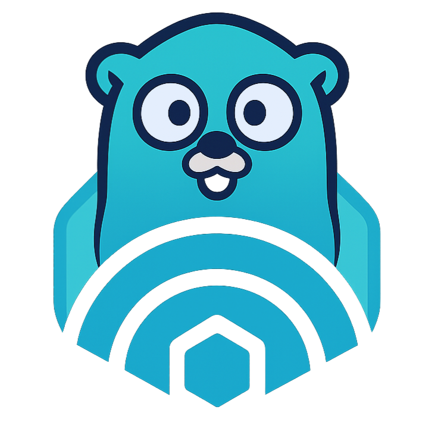

# Doppler — minimal k8s-image-doppler



- Watches **Deployments** and **Pods**
- Mirrors container images to **AWS ECR** (via AWS SDK v2 + IRSA) or a **generic Docker registry**
- Optional namespace filter via `INCLUDE_NAMESPACES` (e.g. `"default,prod"` or `"*"` for all)

## Env
- `TARGET_KIND`: `ecr` (default) or `docker`
- `AWS_REGION`, `ECR_ACCOUNT_ID`, `ECR_REPO_PREFIX`, `ECR_CREATE_REPO` (for ECR)
- `TARGET_REGISTRY`, `TARGET_REPO_PREFIX`, `TARGET_USERNAME`, `TARGET_PASSWORD`, `TARGET_INSECURE` (for Docker)
- `INCLUDE_NAMESPACES`: `*` or comma list (e.g., `default,prod`)

## Build container
```bash
docker build -t ghcr.io/matzegebbe/k8s-image-doppler:latest .
```

## How it works
- Manager (controller-runtime) runs 2 controllers (Deployments, Pods)
- On events we collect images from the PodSpec and push them to the target registry

## Dry Run Mode

You can run Doppler in dry run mode to simulate image pushes without actually pushing them. This is useful for testing and validation.

Enable dry run mode by either:
- Passing the `--dry-run` flag to the binary
- Setting `dryRun: true` in your config file

In dry run mode, Doppler will log the actions it would take instead of pushing images.

