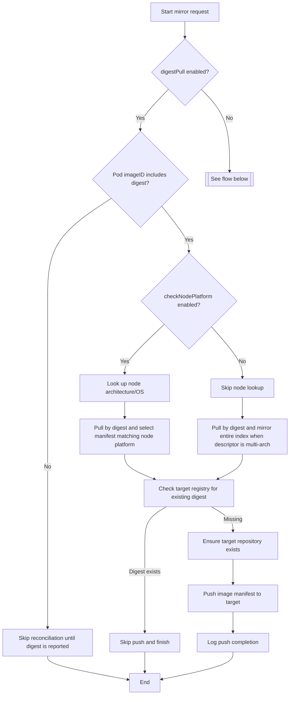
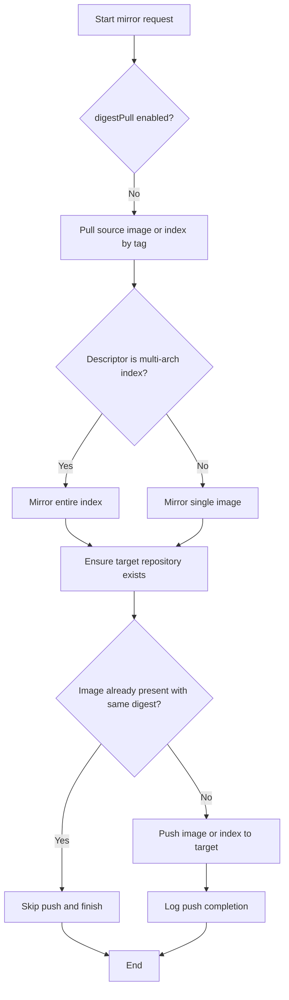

# Mirroring flow

This flow chart summarizes how the pusher reconciles images when digest mirroring is enabled versus disabled.

## Why “pull by digest” can still copy other variants

When `digestPull` is enabled it might feel like the controller should only ever copy the single manifest identified by the digest the workload runs. In practice Kubernetes and container runtimes often publish the *index* digest for multi-architecture images, so additional context is required to avoid mirroring every variant.

### Why other manifests are mirrored

- Kubernetes reports each container’s `ImageID`, and with `digestPull` enabled copycat rewrites the source reference to that digest before contacting the registry.
- For many multi-architecture images (for example, the `nginx:1.28` release), the digest stored in `ImageID` is the **index** digest, not the per-platform manifest digest. Resolving that digest returns an OCI index that still contains every platform variant plus attestations.
- Without the node’s platform, copycat has no hint to pass to `remote.WithPlatform`, so it mirrors the whole index to make sure every architecture remains available. That keeps the right image ready even if the running workload migrates to a different node type later.

### How node metadata avoids foreign digests

- When the reconciler includes the node’s architecture/OS in the metadata, the pusher can call `remote.WithPlatform` and select the matching descriptor from the multi-arch index instead of mirroring the full list.
- With that hint, the only manifest mirrored is the one your node actually runs, so foreign digests no longer appear in the target registry.

Enable this behaviour with the `checkNodePlatform` config option (or the `CHECK_NODE_PLATFORM` environment variable). When it is enabled the controller needs RBAC permission to `get` core `nodes` so it can read the scheduled node's platform details. When the option is disabled—the default—the controller mirrors every runnable manifest from the index to keep all architectures in sync.

### When digest-only would work without platform data

- If the runtime surfaced the exact per-platform manifest digest (for example, `nginx@sha256:10f4…`) in `ImageID`, the registry lookup would directly return the single manifest image and platform hints would be unnecessary.
- In practice, Kubernetes/containerd usually publish the index digest instead, so copycat needs extra context to decide which manifest to mirror.
