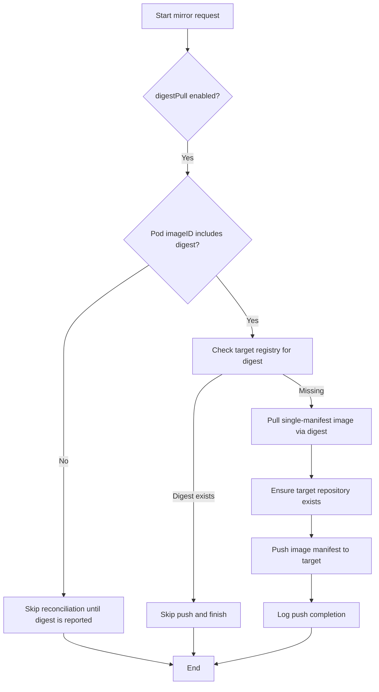
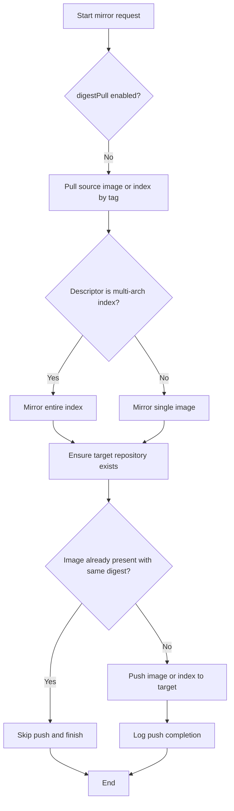

# Mirroring flow

```mermaid
flowchart TD
    A[Start mirror request] --> B{digestPull enabled?}
    B -- Yes --> C{Pod imageID includes digest?}
    C -- No --> D[Skip reconciliation until digest is reported]
    C -- Yes --> E[Check target registry for digest]
    E -- Digest exists --> F[Skip push and finish]
    E -- Missing --> G[Pull single-manifest image via digest]
    G --> H[Ensure target repository exists]
    H --> I[Push image manifest to target]
    I --> J[Log push completion]
    F --> K[End]
    D --> K
    J --> K

```

```mermaid
flowchart TD
    A[Start mirror request] --> B{digestPull enabled?}
    B -- No --> C[Pull source image or index by tag]
    C --> D{Descriptor is multi-arch index?}
    D -- Yes --> E[Mirror entire index]
    D -- No --> F[Mirror single image]
    E --> G[Ensure target repository exists]
    F --> G
    G --> H{Image already present with same digest?}
    H -- Yes --> I[Skip push and finish]
    H -- No --> J[Push image or index to target]
    J --> K[Log push completion]
    I --> L[End]
    K --> L

```

This flow chart summarizes how the pusher reconciles images when digest mirroring is enabled versus disabled.
